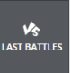
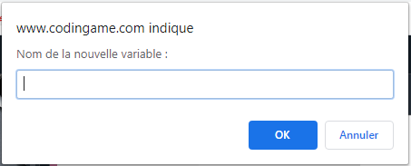

# Codingame4Kids 
Chrome extension that enable to play "The Great Escape" bot multiplayer game with blockly that genarates javascript (French only)

# Notice en français 

## Introduction
L'objectif de cette extension Chrome est de pouvoir jouer au jeu "The Great Escape" du site Codingame en utilisant une programmation par bloc (comme dans Scratch pour ceux qui connaissent). \

### Codingame
C'est un site pour apprendre le développement informatique ou se perfectionner.
Il s'adresse à des étudiants ou des développeurs débutants ou confirmé.
On y trouve des "Puzzles" à résoudre ainsi que des compétitions (multiplayer) où des IA (Intelligence Artificielle) s'affrontent sur jeu.
### Le multiplayer 'The Great Escape'
Dans ce jeu, le but est d'atteindre le bord opposé de son point de départ tout en ajoutant des murs pour empêcher les adversaires d'arriver en premier, le tout en évitant les murs posés par vos adversaires.
### Les Pré-requis
Cette extension s'adresse plutôt à des collégiens/lycéens ayant déjà une expérience en programmation par bloc.
Pour une première expérience, ou pour les plus jeunes, il est plutôt conseillé de s'orienter vers:
- http://www.code.org
- https://scratch.mit.edu/

## Etape 1: Télécharger l'extension
1. Sur Chrome, cliquer sur Application: \

2. Cliquer sur "Web Store": \

3. Dans la barre de recherche, taper "Codingame 4 Kids" et la touche Entrée: \

4. Cliquer sur "Ajouter à chrome".\

## Etape 2: Créer un profil sur Codingame
### Créer un compte
1. Aller sur http://www.codingame.com
2. Cliquez sur 
3. Ajouter une adresse mail et choisir un mot de passe (ou se connecter avec google, facebook, etc...):\

### Ajouter une image (optionnel)
1. Cliquer sur votre avatar en haut à gauche: \

2. Choisir "MON PROFIL"
3. Cliquer sur "AJOUTER UNE IMAGE". \

### Ajouter des amis (optionnel)
1. Sur la page de profil (voir ci-dessus), cliquez sur l'onglet "AMIS": \

2. Cliquer sur "TROUVEZ VOS AMIS"
3. Chercher le pseudo de vos amis (Ajoutez bourgeof!) \

## Etape 3: Aller sur "The Great Escape"
1. sur http://wwww.codingame.com, dans le menu du haut, choisir \
.
2. Cliquer sur le texte "COMBATS DE BOTS": \
 
2. Trouver et cliquer sur "The GREAT ESCAPE": \

4. Cliquer sur \

5. Si tout se passe bien vous devriez voir ceci: \

Note: Si à droite à la place de l'écran blanc avec la poubelle, il y a du code, alors l'extension n'est pas correctement installée.
Ré-essayer l'étape 1, puis raffraichir cette page (F5).

## Etape 4: Découverte de l'interface de Codingame

1. Partie de gauche\

2. Partie de droite\

## Etape 5: Un premier code

### Choisir le language Javascript
L'extension va transformer les blocs en code Javascript.
Il faut choisir ce language.
Sinon, ça ne marchera pas.\

### Aggrandir la fenêtre d'édition
Pour avoir plus de place, pour poser les blocs, il suffit de cliquer sur l'icône  en haut à droite de la fenêtre.\
Puis, pour revenir au mode par défaut, il suffit de recliquer au même endroit sur .

### Construire une première IA
1. Ajouter le bloc principal. Ce bloc est indispensable. Il ne doit y en avoir qu'un seul!\

2. Si on teste le code avec le bouton , le message d'erreur suivant apparaît:\

3. Il est temps d'ajouter une première action. Dans le menu Actions, choisir le bloc "Jouez une action" et le faire glisser dns la section "A chaque tour, faire".
Dorénavant, à chaque tour, notre personnage va essayer d'avancer d'une case en avant vers son objectif.
4. Appuyer de nouveau sur le bouton   ou sur .
5. Avez-vous battu le boss?
6. Si oui, il est temps d'envoyer votre code dans l'arêne! Pour cela, cliquez sur  
7. Si vous n'aviez pas encore choisi de pseudo, cette fenêtre va vous demandez d'en choisir un: \

### Dans l'arêne!
1. Et c'est parti! Votre programme affronte tous les autres programmes que d'autres joueurs ont également soumis.\

2. Dans l'arêne, votre programme effectue 100 parties contre d'autres programmes choisis en fonction du classement courant.
Lorsque le pourcentage de "COMBATS EN COURS" arrive à 100%, le classement ne bouge plus. C'est votre classement final.
il est plus facile visualiser ce qui se passe dans cette arêne, si vous avez un chargé une image (voir Etape 2). 

## Etape 6: Battre le boss et passer dans la ligue supérieur
### Observer les matchs de l'arêne
Pour voir les matchs, il suffit de cliquer sur \
Pour battre le boss de la ligue, il faut gagner plus de matchs que lui.\
Il faut donc regarder les matchs perdus et comprendre la raison de ces défaites.\
En cliquant sur  sur un match perdu, il est possible de comprendre la raison de cette défaite.\

### Changer le code pour gagner un match perdu
En cliquant sur , le match est envoyé dans la partie droite. Il est alors possible de changer le code et rejouer le match avec le bouton  jusqu'à ce qu'il soit gagné.
Réussirez-vous? Aide vous de la descripition des blocs ci-dessous:

# Description des blocs

Les blocs des sections "Jeu", "Actions", "Joueurs", "Logique", "Nombre", "Texte" et "Variables" sont suffisants pour les premières ligues.\
Ils simplifient le jeu en permettant de ne pas se soucier des coordonnées (x, y) et des ids des différents personnages.\
Les sections notées (Avancées) permettent de faire des choses plus poussées mais demandent un effort plus important. 

## Jeu
\
C'est le bloc principal. Il est indispensable.

## Actions
### Jouer une action
\
C'est le second bloc le plus important. \
Il permet de jouer une action en affichant un message.\
Il faut mettre l'une des action suivante à l'intérieur:
- "Action se déplacer"
- "Action mettre un mur"

### Action se déplacer
\
Cette action peut être utilisée dans "Jouer une action" ou dans "Tester si une action est valide".\
Pour cette action, le personnage est toujours tourné vers sa ligne d'arrivée.\
En choisissant:
- "en avant", le personnage essaie d'avancer vers sa ligne d'arrivée.
- "à gauche", le personnage fait un pas sur la gauche. 
- "à droite", le personnage fait un pas sur la droite. 
- "en arrière", le personnage fait un pas en arrière. 

### Action mettre un mur

Cette action peut être utilisée dans "Jouer une action" ou dans "Tester si une action est valide".\
Elle permet de poser un mur à côté d'un personnage.\
Le personnage cible doit être mis sur la droite de l'action.\
Ce bloc s'utilise avec les blocs adversaires (dans Joueurs, voir plus bas).\
Il est possible de poser un mur:
- devant (dépasse à gauche) 
- devant (dépasse à droite) 
- à gauche (dépasse devant) de 
- à gauche (dépasse derrière) de 
- à droite (dépasse devant) de 
- à droite (dépasse derrière) de 
- derrière (dépasse à gauche) 
- derrière (dépasse à droite) 

`Note: Dans les images ci-dessus la ligne d'arrivée de l'adversaire est à gauche.`
### Tester si une action est valide
\
Ce bloc permet de tester si une action est valid ou non.\
Il faut l'utiliser avec un bloc "Si / Sinon" (dans "Logique").\
Cela permet de tester:
- qu'une action "Avancer" est valide (que le personnage ne fonce pas dans un mur).
- qu'une action "Mettre un mur" est valide (qu'il est possible de mettre un mur à cet endroit)

`Note: Il n'est pas possible de poser un mur qui chevauche ou traverse un autre mur.`\
`Note: Il est également interdit d'enfermer le joueur adverse.`

## Joueurs
### Mon personnage
\
A utiliser avec le bloc ci-dessous.
### Tester un état
\
Permet de tester si un personnage peut:
- avancer
- faire un pas sur sa gauche
- faire un pas sur sa droite
- reculer

Il est possible d'y insérer le bloc "Mon personnage" ou la variable "adversaire" à l'intérieur d'un bloc adversaires. (voir plus bas)

### Nombre de murs restants
\
renvoie le nombre de murs qu'un personnage peut encore poser. \
Il est possibe de le connecter au bloc "Mon personnage" ou la variable "adversaire" à l'intérieur d'un bloc adversaires. (voir plus bas)

### Les adversaires
\
Permet de tester l'état des adversaires ou de poser un murs devant eux.\
Il faut d'abord poser une boucle "Pour chaque élément adversaire dans la liste", puis y connecter "liste d'adversaires".\
Il est alors possible d'utiliser la variable adversaire à l'intérieur de cette boucle.\
Exemple:\

##Logique
### Si / Sinon
\
Un bloc très important. Il faut mettre une condition à droite du "Si" et des choses à faire à l'intérieur du "faire".\
Il est également possible en cliquant sur l'icône  de changer le si pour y ajouter des "sinon si" et/ou un "sinon".\

### comparaison
\
Permet de comparer deux valeurs. A utiliser dans un "si" ou un "sinon si".\
Il est possible d'utiliser différents comparateurs (égal, différent, supérieur, supérieur ou égal, etc...).\
Par exemple:\

### Et / Ou
\
Permet de combiner plusieurs conditions ensemble.
## Nombre
### Un nombre
\
A utiliser dans un bloc de comparaison comme dans l'exemple du bloc "comparaison" ci-dessus.
### Une opération
\
Permet de faire des addition, soustraction, etc...
### Générer un nombre aléatoire
\
Pour générer un nombre aléatoire.

## Texte
\
Permet de manipuler du texte. peut être intéressant lors de l'utilisation des variables.

##Variables
Les variables vous permettront de faire des choese plus poussées et pourquoi pas d'atteindre la ligue argent...\
Ce sont des mémoires dans lequel, on peut stocker un état ou une valeur.\
Une fois qu'une variable existe, il est possible:
- de lui affecter une valeur (soit un nombre, soit un texte)
- d'augmenter ou diminuer la valeur si la valeur est un nombre
- de tester la valeur d'une variable
### Créer une nouvelle variable
\
Lorsqu'on crée un variable, il suffit de lui donner un nom.\

### Mettre une valeur dans une variable
\
Ce bloc permet d'affecter une valeur à une variable.\
On peut mettre un nombre dedans:\
\
Ou du texte:\
\
### Incrémenter la valeur d'une variable
\
Permet d'incrémenter facilement un nombre de 1 ou plus.
### Lire la valeur d'une variable
\
Permet de tester la valeur d'une variable.\
Par exemple:\
\
Ou avec du texte:\
\
