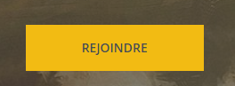
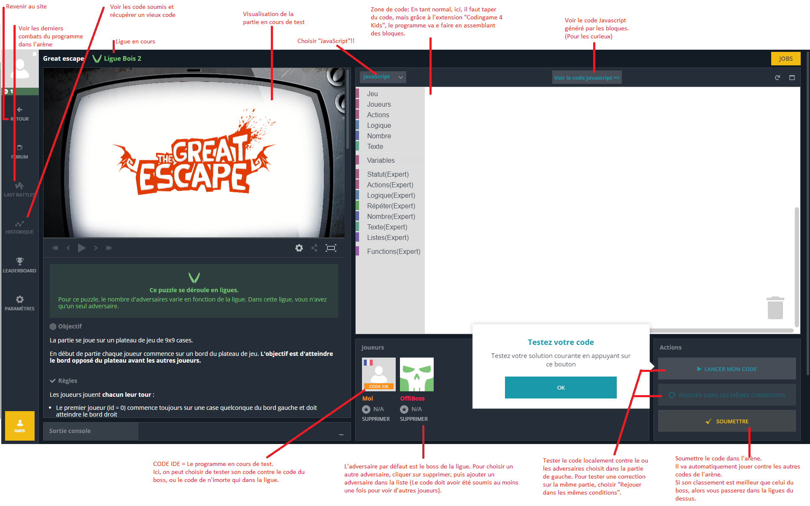

# Codingame4Kids 
Chrome extension that enable to play "The Great Escape" bot multiplayer game with blockly that genarates javascript (French only)

# Notice en français 

## Introduction
L'objectif de cette extension Chrome est de pouvoir jouer au jeu "The Great Escape" du site Codingame en utilisant une programmation par bloque (comme dans Scratch pour ceux qui connaissent). 

### Codingame
C'est un site pour apprendre le développement informatique ou se perfectionner.
Il s'adresse à des étudiants ou des développeurs débutants ou confirmé.
On y trouve des "Puzzles" à résoudre ainsi que des compétitions (multiplayer) où des IA (Intelligence Artificielle) s'affrontent sur jeu.
### Le multiplayer 'The Great Escape'
Dans ce jeu, le but est d'atteindre le bord opposé de son point de départ tout en ajoutant des murs pour empêcher les adversaires d'arriver en premier, le tout en évitant les murs posés par vos adversaires.

## Etape 1: Télécharger l'extension
1. Sur Chrome, cliquer sur Application: 
2. Cliquer sur "Web Store": 
3. Dans la barre de recherche, taper "Codingame 4 Kids" et la touche Entrée: 
4. Cliquer sur "Ajouter à chrome".

## Etape 2: Créer un profil sur Codingame
### Créer un compte
1. Aller sur http://www.codingame.com
2. Cliquez sur 
3. Ajouter une adresse mail et choisir un mot de passe (ou se connecter avec google, facebook, etc...):

### Ajouter une image (optionnel)
1. Cliquer sur votre avatar en haut à gauche: 
2. Choisir "MON PROFIL"
3. Cliquer sur "AJOUTER UNE IMAGE". 

### Ajouter des amis (optionnel)
1. Sur la page de profil (voir ci-dessus), cliquez sur l'onglet "AMIS":

2. Cliquer sur "TROUVEZ VOS AMIS"
3. Ajouter moi en cherchant le pseudo de vos amis (Ajoutez bourgeof!)

## Etpae 3: Aller sur "The Great Escape"
1. sur http://wwww.codingame.com, dans le menu du haut, choisir .
2. Cliquer sur le texte "COMBATS DE BOTS": 
2. Trouver et cliquer sur "The GREAT ESCAPE": 
4. Cliquer sur 
5. Si tout se passe bien vous devriez voir ceci:

Note: Si à droite à la place de l'écran blanc avec la poubelle, il y a du code, alors l'extension n'est pas correctement installée.
Ré-essayer l'étape 1, puis raffraichir cette page (F5).

## Etape 4: Découverte de l'interface

## Etape 5: Un premier code

### Construire une première IA
1. Ajouter le bloque principal. Ce bloque est indispensable. Il ne doit y en avoir qu'un!

2. Si on teste le code avec le bouton "LANCER MON CODE", le message d'erreur suivant apparaît dans la fenêtre de gauche:

### Tester le code

###

## Etape 6: 

